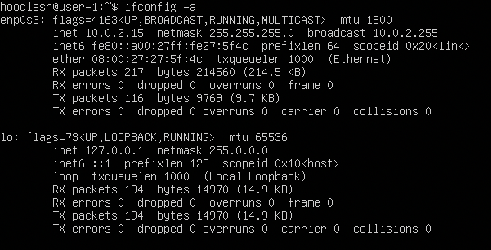

# Операционные системы UNIX/Linux (базовый уровень).

## Установка и модернизация системы Linux. Основы администрирования.

## Содержание

1. [Часть 1. Установка ОС](#часть-1-установка-ос)

2. [Часть 2. Создание нового пользователя](#часть-2-создание-нового-пользователя)

3. [Часть 3. Настройка сети ОС](#часть-3-настройка-сети-ос)

4. [Часть 4. Обновление ОС](#часть-4-обновление-ос)

5. [Часть 5. Использование команды sudo](#часть-5-использование-команды-sudo)

6. [Часть 6. Установка и настройка службы времени](#часть-6-установка-и-настройка-службы-времени)

7. [Часть 7. Установка и использование текстовых редакторов](#часть-7-установка-и-использование-текстовых-редакторов)

   7.1 [Vim](#vim)

   7.2 [Nano](#nano)

   7.3 [Joe](#joe)

8. [Часть 8. Установка и базовая настройка службы SSHD](#часть-8-установка-и-базовая-настройка-службы-sshd)

9. [Часть 9. Установка и использование утилит top, htop](#часть-9-установка-и-использование-утилит-top-htop)

   9.1 [Отчет о выводе команд из top](#отчет-о-выводе-команд-из-top)

   9.2 [Скриншоты вывода команды htop](#скриншоты-вывода-команды-htop)

   9.3 [Сортировать по PID](#сортировать-по-pid)

   9.4 [SORT BY PERCENT_CPU](#sort-by-percentcpu)

   9.5 [сортировать по PERCENT_MEM](#сортировать-по-percentmem)

   9.6 [SORT BY TIME](#sort-by-time)

   9.7 [ФИЛЬТР 'sshd'](#фильтр-sshd)

   9.8 [ПОИСК 'syslog'](#поиск-syslog)

   9.9 [Расширенный вывод имени хоста, часов и времени работы](#расширенный-вывод-имени-хоста-часов-и-времени-работы)

10. [Использование утилиты fdisk](#часть-10-использование-утилиты-fdisk)

11. [Использование утилиты df](#часть-11-использование-утилиты-df)

12. [Использование утилиты du](#часть-12-использование-утилиты-du)

13. [Установка и использование утилиты ncdu](#часть-13-установка-и-использование-утилиты-ncdu)

14. [Работа с системными журналами](#часть-14-работа-с-системными-журналами)

15. [Использование планировщика заданий CRON](#часть-15-использование-планировщика-заданий-cron)


## Часть 1. Установка ОС

Вы можете проверить установленную версию Ubuntu, выполнив команду:

```c
$ cat /etc/issue
```


## Часть 2. Создание нового пользователя

Чтобы создать нового пользователя и добавить его в группу adm, выполните следующие действия:

```c
$ sudo adduser <имя_пользователя>
$ sudo usermod -aG adm <имя_пользователя>
$ cat /etc/passwd | grep <имя_пользователя>
```


Вы также можете проверить список групп пользователей с помощью команды:

```c
$ groups <имя_пользователя>
```
## Часть 3. Настройка сети ОС

1. Установите имя новой машины как user-1. Для этого вы можете использовать команду:

```c
$ hostnamectl set-hostname <имя_хоста>
```
>Для отображения информации о системе, включая текущее имя хоста, вы можете использовать команду:
```c
$ hostnamectl
```
>или:
```c
$ hostname
```


2. Установите часовой пояс, соответствующий вашему текущему местоположению.
```c
$ sudo timedatectl
$ sudo timedatectl set-timezone Europe/Moscow
$ sudo timedatectl
```

3. Выведите имена сетевых интерфейсов с помощью команды console. Для этого необходимо установить набор сетевых инструментов:
```c
$ sudo apt install net-tools
```
>Для вывода имен сетевых интерфейсов можно использовать новую команду:
```c
$ ifconfig -a
```

>Интерфейс ``lo (Local Loopback)`` - это специальное виртуальное соединение на вашем компьютере, которое позволяет ему отправлять и получать данные без подключения к Интернету или другим устройствам. Вы можете использовать его для тестирования и проверки сетевых приложений на своем компьютере так же, как если бы они работали на удаленном сервере. Он уже настроен и доступен в Linux по умолчанию, и вам не нужно ничего дополнительно настраивать.

4. Чтобы получить IP-адрес устройства, с которым вы работаете, от сервера DHCP. Используйте эту команду:
```c
$ hostname -I
```

>``DHCP`` расшифровывается как "Dynamic Host Configuration Protocol"``. DHCP - это протокол сетевого уровня, который позволяет устройствам автоматически получать IP-адрес, подсеть, шлюз по умолчанию и другие сетевые настройки от специального сервера, известного как DHCP-сервер.
5. Определите и отобразите внешний IP-адрес шлюза (ip) и внутренний IP-адрес шлюза, также известный как IP-адрес по умолчанию (gw).
>Определение внешнего IP-адреса шлюза:
```c
$ curl ifconfig.me/ip
```

>Определите внутренний IP-адрес шлюза:
```c
$ ip route
```


6. Установите статические (установленные вручную, а не полученные от DHCP-сервера) настройки ip, gw, dns (используйте публичные DNS-серверы, такие как 1.1.1.1 или 8.8.8.8).
>Для изменения файла используйте vim
```c
$ sudo vim /etc/netplan/00-installer-config.yaml
```

>Сохраните изменения и перезагрузите машину
```c
$ sudo netplan apply
$ reboot
```
>Сейчас убедитесь, что настройки были изменены 
```c
$ ping 1.1.1.1
$ ping ya.ru
```

>Также проверьте, успешно ли пингуются удаленные хосты 1.1.1.1 и ya.ru


## Часть 4. Обновление ОС
>Для обновления просто введите команду в терминал. После обновления системных пакетов, если вы снова введете команду update, вы должны получить сообщение об отсутствии обновлений.
```c
$ sudo apt update
$ sudo apt upgrade
```

## Часть 5. Использование команды sudo
>Команда ``sudo`` - это сокращение от "Superuser Do". Она используется в операционных системах Unix и Unix-подобных системах, таких как Linux, чтобы позволить обычным пользователям выполнять команды с повышенными привилегиями или в качестве суперпользователя (администратора).

Чтобы разрешить пользователю выполнять команду ```sudo'', вам понадобятся следующие команды:
```c
$ sudo usermod -a -G sudo user-1
$ su user-1
$ cat /etc/hostname
$ sudo hostname <name>
$ su <name>
``` 


## Часть 6. Установка и настройка службы времени
```c
$ sudo timedatectl
$ timdatectl show
```


## Часть 7. Установка и использование текстовых редакторов
>Чтобы установить текстовый редактор VIM, NANO, JOE, необходимо ввести следующие команды:
```c
$ sudo apt update
$ sudo apt install vim
$ sudo apt install nano
$ sudo apt install joe
```
### Vim
```c
$ vim test_vim.txt
```
>Режим редактирования ``I''

>Для выхода из режима редактирования ``Esc``.

>Для сохранения изменений ``Shift + Z + Z``''

>Чтобы изменения не переливались через ``:q!``''


>Для поиска слова в файле вы можете использовать команду ```/word``, где ```"word"`` - это то, что вы ищете. Например, чтобы найти слово ```пример``, вы можете набрать ```/example`` после нажатия Esc.


>После того, как Vim найдет первое совпадение, вы можете заменить это слово на другое с помощью команды ```:%s/old_word/new_word/g``, где ```"old_word"`` - слово, которое вы хотите заменить, а ``"new_word"`` - новое слово, которым вы хотите его заменить.


### Nano
```c
$ nano test_nano.txt
```

>Для сохранения изменений ``Ctrl + O > Enter``. 

>Для выхода из Nano ``Ctrl + X``` 

>После нажатия ``Ctrl+X`` откроется меню Nano. На экране появится вопрос "Save modified buffer? (Сохранить измененный буфер?). Чтобы ``выйти без сохранения`` изменений, нажмите клавишу N (символ ``'N'``).


>``Ctrl + W``, чтобы открыть поиск по содержимому файла.
Введите слово или фразу, которую вы хотите найти, и нажмите ``Enter``.


>Чтобы заменить найденное слово или фразу на другое, используйте комбинацию клавиш ``Alt + R`` или ``Option + R``, затем введите новое слово или фразу. Для замены нажмите ``Enter``.


### Джо
```c
$ joe test_nano.txt
```

>Для выхода из Джо ``Ctrl + K`` после нажатия ``X``. 

>Выберите в меню пункт "Сохранить и выйти". Для этого переместите курсор или используйте соответствующие клавиши на клавиатуре, чтобы выделить этот пункт, затем нажмите клавишу Enter.

>Для выхода из режима редактирования текста можно также использовать комбинацию клавиш ``Ctrl+K`` и затем ``Q`` (символ "Q") для выхода из редактора.
Если в файл были внесены изменения, Джо спросит: "Сохранить измененный буфер?". (``Save modified buffer?``). Чтобы выйти без сохранения изменений, нажмите клавишу ``N`` (символ 'N').


>Нажмите ``Ctrl + K``, затем нажмите клавишу ``F``. Откроется строка поиска в нижней части экрана.


>Для замены нажмите клавишу ``Ctrl + K``, затем клавишу ``F``. Откроется строка поиска в нижней части экрана. Введите искомое слово, затем нажмите Enter. Джо предложит выбор, нажмите ``R`` для замены слова, затем введите новое слово. Нажмите Enter, чтобы заменить найденные выделенные совпадения.


## Часть 8. Установка и базовая настройка службы SSHD

>Сначала необходимо установить службу SSHd.
```c
$ sudo apt-get install ssh
```
>Для настройки автозапуска служб при старте системы. Введите:
```c
$ sudo systemctl enable ssh
$ systemctl status ssh
```


>Переконфигурируйте службу SSHd на порту 2022.

```c
$ sudo vim /etc/ssh/sshd_config
```


```c
$ systemctl restart sshd
```


>Чтобы показать наличие процесса sshd, используйте команду ps.

```c
$ ps -e | grep sshd
```

- `ps` (показывает запущенные процессы, выполняемые пользователем в окне терминала);
- `ps -e` или `ps -A` (Для просмотра всех запущенных процессов);
- `ps -d` (Чтобы показать все процессы, кроме лидеров сессий);
- `ps -d -N` (Вы можете инвертировать вывод с помощью переключателя `-N`. Например, если я хочу отобразить только лидеров сессий)
- `ps T` (показывает только процессы, связанные с этим терминалом);
- `ps r` (посмотреть все запущенные (`running`) процессы);
- `ps -p 'pid'` (если вы знаете PID процесса, вы можете просто использовать следующую команду, чтобы вывести процесс с этим `'pid'`);
- `ps -p 'pid1' 'pid2'`
- `ps U 'userlist'` (найти все процессы, выполняемые определенным пользователем);
- `ps -ef` (получить полный список).


>Осталось только перезагрузить систему.

```c
$ reboot
$ service ssh restart
$ netstat -tan 
```

- `-t (--tcp)` отображает только tcp соединения;
- `-a (--all)` отображает все активные TCP соединения;
- `-n (--numeric)` отображает активные TCP соединения с адресами и номерами портов в числовом формате;
- `Proto:` имя протокола (протокол TCP или протокол UDP);
- `recv-Q:` очередь на получение сети;
- `end-Q:` очередь на отправку сети;
- `Local Address` адрес локального компьютера и номер используемого порта;
- `Foreign Address` адрес и номер удаленного компьютера, к которому подключен сокет;
- `State` состояние сокета;
- `0.0.0.0` означает IP-адрес локального компьютера.


## Часть 9. Установка и использование утилит top, htop

### Отчет о выводе команды top из top:

```c
$ top
```


- `время работы` - 1 час 19 мин;

- `количество авторизованных пользователей` - 1;

- `общая нагрузка на систему` - 0.00 0.00 0.00;

- `общее количество процессов` - 95;

- `загрузка процессора` - 0.0%;

- `загрузка памяти` - 155M/964M;

- `PID процесса, использующего больше всего памяти` - 657;

- `PID процесса, занимающего больше всего процессорного времени` - 1138.

### Скриншоты вывода команды htop:

```c
$ sudo apt install htop
$ htop
```
#### SORT BY PID


#### СОРТИРОВКА ПО PERCENT_CPU


#### СОРТИРОВКА ПО PERCENT_MEM


#### СОРТИРОВКА ПО ВРЕМЕНИ


#### ФИЛЬТР 'sshd'


#### ПОИСК 'syslog'


#### Расширенный вывод имени хоста, часов и времени работы


## Часть 10. Использование утилиты fdisk

```c
$ sudo fdisk -l
$ swapon
```


- `Имя диска` - VBOX HARDDISK;
- `Размер диска` - 25GiB;
- `Количество секторов` - 52428800;
- `Размер свопа` - 1.5G.

## Часть 11. Использование утилиты df

```c
$ df
```


Отчет для корневого раздела (/):

- `размер раздела` - 11758760 Кбайт;
- `размер используемого пространства` - 4919644 Кбайт;
- `размер свободного пространства` - 6220008 Кбайт;
- `процент использования` - 45%.

Отчет для корневого раздела (/):

- `размер раздела` - 12 Гбайт;
- `размер используемого пространства` - 4,7 Г;
- `размер свободного пространства` - 6.0 Г;
- `процент использования` - 45%;
- `тип файловой системы для раздела` - ext4.
## Часть 12. Использование утилиты du

```c
$ sudo du -sh /var/log /var /home 
$ sudo du -s --block-size=1 /var/log /var /home  
```


```c
$ sudo du -sh /var/log/* 
```


## Часть 13. Установка и использование утилиты ncdu

```c
$ sudo apt install ncdu
```
```c
$ ncdu /home/
```


```c
$ ncdu /var/
```


```c
$ ncdu /var/log/
```

## Часть 14. Работа с системными журналами

```c
$ sudo vim /var/log/dmesg
$ sudo vim /var/log/syslog
$ sudo vim /var/log/auth.log
```


- Последняя успешная авторизация: Jul 4 11:48:36;
- Имя пользователя: hoodiesn;
- Метод входа: pam-unix.

```c
$ sudo systemctl restart ssh
$ cat /var/log/syslog
```


## Часть 15. Использование планировщика заданий CRON

Чтобы использовать планировщик заданий, выполняйте команду uptime каждые 2 минуты. Вам нужно открыть планировщик и добавить задание (*/2 * * * * * uptime).

```c
% sudo crontab -e
```


```c
% sudo crontab -l
```


>Логи задач из планировщика:


>Удаление всех задач из планировщика:

```c
$ sudo crtontab -r
$ sudo crtontab -l
```

